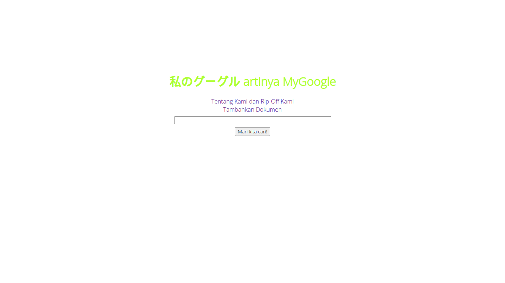

# 私のグーグル
Sebuah project yang dibuat untuk memenuhi tugas besar matakuliah IF2123 (Aljabar Linear dan Geometri).

## Daftar Isi
[General Info](#general-info)\
[Screenshots](#screenshots)\
[Setup](#setup)\
[Features](#features)\
[Inspiration](#inspiration)\
[Contact](#contact)\
[Pembagian Tugas](#pembagian-tugas)

## General Info
Project ini adalah project yang berkaitan dengan salah satu materi kuliah matakuliah IF2123, yaitu Aljabar Vektor. Di dalam Aljabar Vektor, terdapat aplikasi dot product pada Information Retrieval dengan Vector Space Model. Lalu kami membuat sebuah search engine yang beroperasi berdasarkan Vector Space Model.

## Screenshot


## Setup
### Untuk Linux
Buka terminal, pindah ke directory yang diinginkan, lalu jalankan kode berikut
```
git clone https://github.com/andrcyes/Algeo02-19036.git
cd Algeo02-19036
cd src
source env/bin/activate
pip3 install -r requirements.txt
```
### Untuk Windows
> Note: Untuk Windows, pastikan sudah terinstall virtualenv
Buka Command Prompt, run as administrator, pindah ke directory yang diinginkan, lalu jalankan kode berikut
```
git clone https://github.com/andrcyes/Algeo02-19036.git
cd Algeo02-19036
cd src
virtualenv wenv  
.\wenv\Scripts\activate 
pip install -r requirements.txt
```
### Menjalankan Program
di dalam folder src dengan env ter-activate (untuk Linux) atau wenv ter-activate (untuk Windows), jalankan
```
flask run
```
lalu copy link localhost ke dalam browser.

## Features
Fitur-fitur yang terdapat di dalam project kami
* Search Engine
* Menampilkan kalkulasi kemiripan dokumen dan menampilkannya pada laman web
* Menambahkan dokumen ke dalam database
* Perihal (Konsep singkat search engine, How to Use, dan About Us)

## Inspiration
Project ini terinspirasi oleh adanya tugas besar kedua matakuliah IF2123.

## Contact
Dibuat oleh sebuah kelompok yang beranggotakan:
* [Andrew](https://github.com/andrcyes)
* [Moses](https://github.com/mosesananta)
* [Rizal](https://github.com/MrizalMuhaimin)

## Pembagian Tugas
Andrew : Membuat Front-End\
Moses : Membuat Back-End\
Rizal : Membuat Back-End